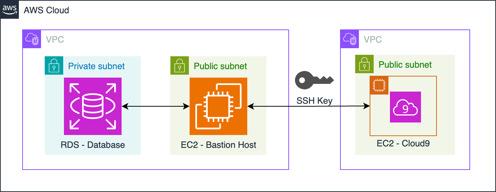

# Week 3 Lab 1:<br>Implementing DataOps with Terraform

In this lab, you will use [Terraform](https://www.terraform.io/intro), as an
infrastructure as code (IaC) tool, to deploy a database instance via a bastion
host.

## 1 - Introduction to the Lab

A bastion host, also known as a jump server, is an intermediary server that acts
as a gateway or a bridge that connects authorized users from the public internet
to the resources hosted within a private network. When an authorized user wants
to access the private network, they have to establish an SSH or secure shell
connection to the bastion host to securely access the private resources. Using
an SSH key, the external users can prove their identity to connect to the
bastion host. Once the users are authenticated, the bastion host can forward
their requests to the internal network. By enforcing security policies, a
bastion can mitigate the risk of unauthorized access to sensitive systems within
the network.



Here's the diagram of the bastion host architecture that you will implement in
this lab. It consists of an RDS database instance hosted inside a private subnet
of a given VPC, and an EC2 instance that acts as the bastion host. The EC2
instance resides in a public subnet within the same VPC so that it can receive
external traffic from the public internet before relaying the secure traffic to
the internal database. In this lab, the VPC with its private and public subnets
are already created and provided to you. You will use Terraform to create the
database instance and the EC2 instance that is acting as the bastion host.

You will also use Terraform to generate an SSH key pair, which consists of a
public key that you will store in the EC2 instance and a corresponding private
key that you will save in a separate file. The pair of public and private keys
are used to encrypt and decrypt the messages between the external user and the
bastion host during an SSH connection, in order for the external connection to
prove its identity. In the lab, after you create all the resources in Terraform,
you will use the private key to connect to the RDS database via the bastion host
from the cloud9 terminal.

### Terraform Configuration Files

The `terraform` folder contains the Terraform configuration files that you will
edit and run to provision the resources for your bastion host architecture. The
files are organized as follows:

- Inside the modules folder, you can find the `bastion_host` module which
  consists of the configuration files for each of the RDS and EC2 instances as
  well as the networking resources (`rds.tf`, `ec2.tf`, `network.tf`). The
  module also includes other configuration files that contain the definitions of
  the module input variables, output values and required providers
  (`variables.tf`, `outputs.tf`, `providers.tf`).
- Outside the modules folder, you can find the main terraform configuration
  files of the root directory (`main.tf`, `variables.tf`, `outputs.tf`,
  `backend.tf`). The `main.tf` declares the `bastion_host` module and the
  module's input variables. You can also find the `tfvars` file that you will
  use to assign values to some input variables.

When you run Terraform to execute commands or apply changes, Terraform
concatenate all these `*.tf` files in one configuration file.

> **IMPORTANT**
> The AWS permissions given to you are set up with the [least privilege principle](https://csrc.nist.gov/glossary/term/least_privilege#:~:text=Definitions%3A,needs%20to%20perform%20its%20function.) 
and are usually constrained by name (e.g., resources should have a name with the prefix `de-c2w3lab1`) or resource specs (e.g., using a `t3.small` instance type). Please adhere to instructions and refrain from creating other resources.

## 2 - Infrastructure Configuration

In this section, you will edit multiple configuration files. Make sure to read
the instructions carefully and to save your changes in any of the files by
pressing `Ctrl+S` or `Cmd+S`.

### 2.1 - Provided Resources

You are provided with the networking resources for your infrastructure, such as
the VPC and its private and public subnets. These resources were created through
a CloudFormation stack. You can check the stack's information in the AWS Console
by searching **CloudFormation** in the search bar. You will see two different
stacks, one of them has a name starting with the prefix `aws-cloud9` while the
other stack name has an alpha-numeric ID. Click on the alpha-numeric ID stack
and then click on the **Outputs** tab. If you scroll down, you can find the
names of each of the aforementioned resources. The column value contains the ID
for each resource, which what you will later use in the terraform files.

You can also find the ID of other resources such the S3 bucket and the DynamoDB
table, that you will use to configure the backend store.

### 2.2 - Backend

When you apply a Terraform configuration, Terraform generates a `tfstate` file.
This file specifies the state of the configuration - showing which resources
have been created. You can share the `tfstate` file with teams working on the
same collection of resources using the [Terraform
Cloud](https://cloud.hashicorp.com/products/terraform) service and AWS services,
and you can protect it from simultaneous editing.

Complete the lines of the [s3
backend](https://www.terraform.io/language/settings/backends/s3) block in the
[`backend.tf`](terraform/backend.tf) file with the IDs of the following S3
bucket and DynamoDB table. The S3 bucket will store the `tfstate` file, and the
DynamoDB table will prevent users from simultaneously editing the file.

- S3 bucket: `de-c2w3lab1-<AWS-ACCOUNT-ID>-us-east-1-terraform-state`. Go to the
  AWS console and click on the upper right part, where your username
  appears.Copy the **Account ID** by clicking the copy button beside it. Replace
  the placeholder `<AWS-ACCOUNT-ID>` with the Account ID that you copied. Or you
  can get the id of the S3 bucket from the CloudFormation stack.
- Key: `de-c2w3lab1/terraform.state` (this is the S3 key or identifier assigned
  to the `tfstate` file in the bucket)
- Region: `us-east-1`
- DynamoDB table: `de-c2w3lab1-terraform-state-lock`.

*Note*: Remember to save your changes in any of the files by pressing `Ctrl+S`
or `Cmd+S`.

### 2.3 - Variables

You are provided with two `variables.tf` files:

- the main `variables.tf` file
  ([terraform/variables.tf](terraform/variables.tf)): it contains the
  definitions for the variables used in the `main.tf` file. These variables are
  used to pass values to the input variables of the `bastion_host` module.
- the `variables.tf` file in the `bastion_host` module
  ([terraform/modules/bastion_host/variables.tf](terraform/modules/bastion_host/variables.tf)):
  it contains the definitions for the variables used in the configuration files
  inside the module.

For each file, first read all the variables defined and then complete the lines
needed (indicated between the comments `START CODE HERE` and `END CODE HERE`).
Make sure to read the provided comments for each variable block.  

The variables representing the IDs of the VPC and its subnets do not have
default values. To inject values for these variables, modify the
`terraform.tfvars` file
([terraform/terraform.tfvars](terraform/terraform.tfvars)). Use the information
from the **Outputs** tab (column **Value**) in CloudFormation to fill these
values.

*Note*:

- In general, you should not push into the repository the `terraform.tfvars`
  file if it contains sensitive data.
- Remember to save your changes in any of the files by pressing `Ctrl+S` or
  `Cmd+S`.

### 2.4 - Networking

In the `network.tf` file
([terraform/modules/bastion_host/network.tf](terraform/modules/bastion_host/network.tf)),
you can find the resources and data sources associated with the networking
management, such as the VPC, subnets and security groups.

- Since the VPC and its subnets are already created and provided for you, they
are declared as [Data Blocks](https://www.terraform.io/language/data-sources) in
the `network.tf` file. The data block that declares the VPC is already defined,
but the data blocks for the corresponding subnets are incomplete. Complete the
code to create data blocks of type
[`aws_subnet`](https://registry.terraform.io/providers/hashicorp/aws/latest/docs/data-sources/subnet)
for each of the public and private subnets of the VPC. To define the `id`
argument in each data block, make sure to use the variables that represent the
ID of each subnet from the [variables.tf
file](terraform/modules/bastion_host/variables.tf) of the `bastion_host` module.

- Read the two remaining blocks in the
  [`network.tf`](terraform/modules/bastion_host/network.tf) file. These blocks
  declare two resources of type
  [`aws_security_group`](https://registry.terraform.io/providers/hashicorp/aws/latest/docs/resources/security_group)
  that define the security groups that will be attached to the RDS database and
  to the bastion host.

You will use these networking resources in the configuration files of RDS and
EC2 (bastion host) instances.

*Note*: Remember to save your changes in any of the files by pressing `Ctrl+S`
or `Cmd+S`.

### 2.5 - RDS

In the `rds.tf`file
([terraform/modules/bastion_host/rds.tf](terraform/modules/bastion_host/rds.tf)),
you will configure the resources needed for the deployment of your RDS instance.

- The first block generates a random password that you will use as the master
  password for the database instance.

- The second block creates an
[`aws_db_subnet_group`](https://registry.terraform.io/providers/hashicorp/aws/latest/docs/resources/db_subnet_group)
resource for the RDS database instance. This group consists of two subnets
(according to AWS documentation, at least two subnets should be specified when
you create an RDS database instance, in case you later wanted to switch to
multi-availability zone deployment). Complete this block to create the subnet
group using the two private subnets that you declared as data blocks in the
[`network.tf`](terraform/modules/bastion_host/network.tf) file.

- The third block creates an
  [`aws_db_instance`](https://registry.terraform.io/providers/figma/aws-4-49-0/latest/docs/resources/db_instance)
  resource:
  - For `instance_class`, use the `db.t3.micro` instance type.
  - For `db_subnet_group_name`, use the name of the db_subnet group you created in the second block.
  - For `vpc_security_group_ids`, use the security group you created for the RDS instance in the `network.tf`file.
  - For `username`, use the master username variable defined in the
    [variables.tf file](terraform/modules/bastion_host/variables.tf) in the
    `bastion_host` module.
  - For `password`, use the master password generated in the first block.

*Note*: Remember to save your changes in any of the files by pressing `Ctrl+S` or `Cmd+S`.

### 2.6 - Bastion Host

In the `ec2.tf` file
([terraform/modules/bastion_host/ec2.tf](terraform/modules/bastion_host/ec2.tf)),
you will configure the resources needed for the deployment of your bastion host.

- The first block declares a [`tls_private_key`
  resource](https://registry.terraform.io/providers/hashicorp/tls/latest/docs/resources/private_key)
  that will generate an SSH key pair. The second block stores the private key in
  a local file.
- The fourth block creates an
  [`aws_key_pair`](https://registry.terraform.io/providers/hashicorp/aws/latest/docs/resources/key_pair)
  resource that you can use to register the public SSH key with the EC2
  instance. Complete this block to specify the public key using the
  [`tls_private_key`
  resource](https://registry.terraform.io/providers/hashicorp/tls/latest/docs/resources/private_key)
  you declared in the first block.
- The last block creates an
  [`aws_instance`](https://registry.terraform.io/providers/hashicorp/aws/latest/docs/resources/instance)
  resource or in other words, the EC2 instance representing your bastion host:
  - For `instance_type`, use the `t3.nano` instance type.
  - For `key_name`, use the key_name of the `aws_key_pair` resource you created in the previous block.
  - For `subnet_id`, use the public subnet in the requested availability zone
    (A) you created in the
    [`network.tf`](terraform/modules/bastion_host/network.tf) file.
  - For `vpc_security_group_ids`, use the security group you created for the
    bastion host in the `network.tf`file.

*Note*: Remember to save your changes in any of the files by pressing `Ctrl+S` or `Cmd+S`.

### 2.7 - Terraform Outputs

You are provided with two `outputs.tf` files:

- In the bastion host `outputs.tf` file
  ([terraform/modules/bastion_host/outputs.tf](terraform/modules/bastion_host/outputs.tf)),
  first check out all the output values of the file and then complete the needed
  blocks to define outputs for:
  - Bastion host Instance ID: refer to the `aws_instance` resource you created
    in [`ec2.tf`](terraform/modules/bastion_host/ec2.tf).
  - Bastion host public DNS: also refer to the `aws_instance` resource you
    created in [`ec2.tf`](terraform/modules/bastion_host/ec2.tf) and look for
    the public dns attribute
    [here](https://registry.terraform.io/providers/hashicorp/aws/latest/docs/resources/instance#attribute-reference).
  - RDS host (or address): refer to the `aws_db_instance` resource you created
    in `rds.tf` and look for the host/address attribute
    [here](https://registry.terraform.io/providers/hashicorp/aws/latest/docs/resources/db_instance#attribute-reference).
  - RDS port: same previous comment.
  - Database Username: same previous comment.
  - Database password. Notice that this is a sensitive output. Use `password` to replace the third `None`.
- In the root directory, the `outputs.tf` file
  ([terraform/outputs.tf](terraform/outputs.tf)) exports the output values from
  the `bastion_host` module so you can use them when you run your terraform
  files. You don't need to edit anything this file, just make sure to check it
  out.

With this output information, you will be able to connect to the bastion host
instance and securely connect to your private database.

*Note*: Remember to save your changes in any of the files by pressing `Ctrl+S` or `Cmd+S`.

## 3 - Infrastructure deployment

Now that your Terraform configuration files are ready, it's time to deploy the
infrastructure. For that, you will see that the process can be divided into a
few stages.

### 3.1 - Initialization

`terraform init` is the first step in using Terraform with a new or existing
configuration. When you run `terraform init`, Terraform reads the configuration
files in the directory (the ones with the `*.tf` extension) and initializes the
working directory. During initialization, Terraform downloads the necessary
providers (specified in the
[`providers.tf`](terraform/modules/bastion_host/providers.tf) file) required for
the configuration.

In your Cloud9 terminal, change your working directory to the `terraform` folder:

```bash
cd terraform
```

and then, execute the initialization command:

```bash
terraform init
```

#### 3.2 - Planning

After initialization, you can generate an execution plan using `terraform plan`.
This step compares the current state of the infrastructure with the desired
state described in the configuration files. Terraform analyzes the configuration
files, checks for syntax errors, and determines what actions are necessary to
achieve the desired state. It then outputs a summary of the planned changes,
including which resources will be created, modified, or destroyed. However,
`terraform plan` does not make any changes to your infrastructure.

Execute the following command to generate the execution plan

```bash
terraform plan
```

#### 3.3 - Infrastructure deployment

Once you've reviewed the plan and are ready to make changes, you can apply the
changes using `terraform apply`. This step executes the actions outlined in the
execution plan generated by the terraform plan. Terraform communicates with the
respective cloud providers' APIs to create, update, or delete resources as
necessary  and to align the infrastructure with the desired state described in
the configuration files. Terraform also updates its state file
`terraform.tfstate` to reflect the current state of the infrastructure after
applying the changes.

Now it's the moment to deploy your infrastructure, in the terminal, execute the
following command:

```bash
terraform apply
```

You will see a similar output as the one generated by the execution plan and a
confirmation screen. Type `yes` and you will see the process of creation of each
of the resources. **This process can take a while (around 7-10 minutes)** as
deploying the RDS and the bastion host instances can take some time.

At the end of the process, Terraform will show in the terminal the outputs that
you defined in the [main `outputs.tf`](terraform/outputs.tf) file. You will use
this information in the next steps of the lab.

## 4 - Connection to the Database

### 4.1 - Making sure your RDS is Private

Once the infrastructure has been deployed successfully, you can connect to the
database. As a first test, you will try to connect from the terminal. You can
get the database endpoint from the previous output or running the command:

```bash
terraform output db_host
```

This command will output the password (all of the outputs are in double quotes):
```bash
terraform output db_master_password
```

Now connect to the database replacing the `<RDS-HOST>`  with the `db_host` value:

```bash
psql -h <RDS-HOST> -U postgres_admin -p 5432 -d postgres --password
```

You can see that the connection doesn't take place. Your RDS has been configured
to be private and the only way to access it is through the bastion host.

To exit the attempt either press `Ctrl+C` (it also might be `Cmd+C` or `Ctrl+S`)
or wait for the timeout error to appear.

### 4.2 - Connecting to the Bastion Host

In order to connect to the bastion host, there are several options such as:

* Connecting directly to the bastion host using SSH.
* Creating a SSH tunnel connection to the bastion host from your development environment.

In particular, you will connect through the SSH tunnel as it is a more elegant
way to connect to a remote server. An SSH tunnel is a secure way to transfer
data between two devices over an encrypted connection. It works by establishing
an SSH connection and then creating a secure conduit for transmitting data.
There are two types: local port forwarding and remote port forwarding. SSH
tunnels are used for secure access to services, bypassing firewalls, and secure
browsing. Now, let's create the SSH tunnel connection. Execute the following
command, replacing:

- `<RDS-HOST>` with the output from the command `terraform output db_host`,
- `<DATABASE-PORT>` with the output from the command `terraform output db_port`,
- `<BASTION-HOST-DNS>` with the output from the command `terraform output bastion_host_dns`:

```bash
ssh -i de-c2w3lab1-bastion-host-key.pem -L 5432:<RDS-HOST>:<DATABASE-PORT> ec2-user@<BASTION-HOST-DNS> -N -f
```

Confirm the connection by typing in `yes` and pressing `Enter`. Move back to the parent directory:

```bash
cd ..
```

*Optional Notes*:

- The `ssh` command uses the private key you generated using Terraform to
  authenticate the connection to the bastion host; the `-i` tag means
  identity_file and it specifies the file that contains the SSH private key.
- The `L` options means local port forwarding (`-L
  LOCAL_PORT:DESTINATION_HOSTNAME:DESTINATION_PORT USER@SERVER_IP`): this means
  that you're forwarding the connection from the bastion host to the RDS
  instance.
- The `-f ` option means the command can be run in the background and `-N` means
  "do not execute a remote command".
- If you'd like learn more about SSH tunneling, you can check this
  [article](https://linuxize.com/post/how-to-setup-ssh-tunneling/#remote-port-forwarding).

*End of optional Notes*

With the tunnel configured, you can access the RDS by using this command:

```bash
psql -h localhost -U postgres_admin -p 5432 -d postgres --password
```

You will be prompted to write down the database password.

### 4.3 - Creating a Table

Now that you can connect to the database hosted in a private RDS instance, you
can start working with it. First, you will create a table. Open and inspect the
file at `sql/ratings_table_ddl.sql`. In the terminal where you created the SSH
tunnel connection, execute the following command:

```bash
\i sql/ratings_table_ddl.sql
```

### 4.4 - Populating the table and Inspecting the data

The data to populate the table that you created is located at
`data/ratings_ml_training_dataset.csv` while the script to populate it is at
`sql/copy_data.sql`. Inspect both files to remember the schema of the data and
the code, and in the terminal with your SSH tunnel connection execute the
command:

```bash
\i sql/copy_data.sql
```

After this process, you should be able to query your table. As a starting point
to explore your data, you can use the following query and also try to count the
number of rows that have been inserted.

```sql
SELECT * FROM ratings_training LIMIT 10;
```

Great, you have interacted with a database hosted in a private RDS through a
bastion host that was deployed using Terraform as an IaC tool!

Quit the `psql` prompt with the command `\q`.

## 5 - Tear Down your Infrastructure

Another important advantage of using an IaC tool to manage your infrastructure
is that you can easily destroy some resources or even tear down your whole
infrastructure. The cleaning process is easier to perform when you are not going
to use a certain infrastructure anymore. To do so, check that you are in the
`terraform` directory and run the following command:

```bash
terraform destroy
```  

Execute the command in the terminal to clean up the unwanted resources. You will
see the execution plan for the destruction process and will be asked for
confirmation. Answer `yes` to perform the cleanup process.

**Congratulations!** In this lab, you've successfully implemented DataOps
principles using Terraform as an Infrastructure as Code (IaC) tool to automate
the deployment of a bastion host architecture.
