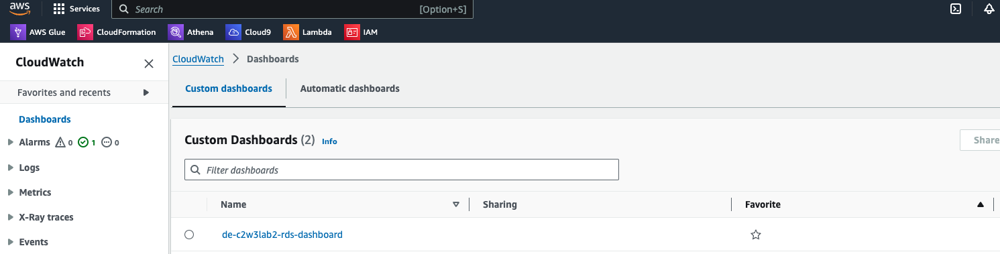
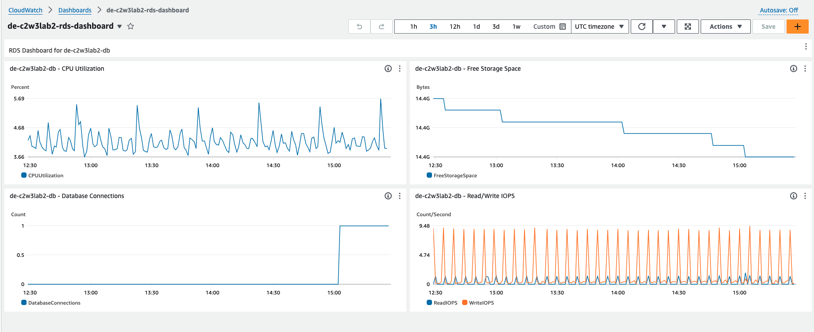
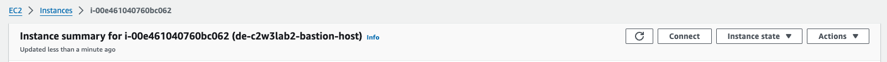
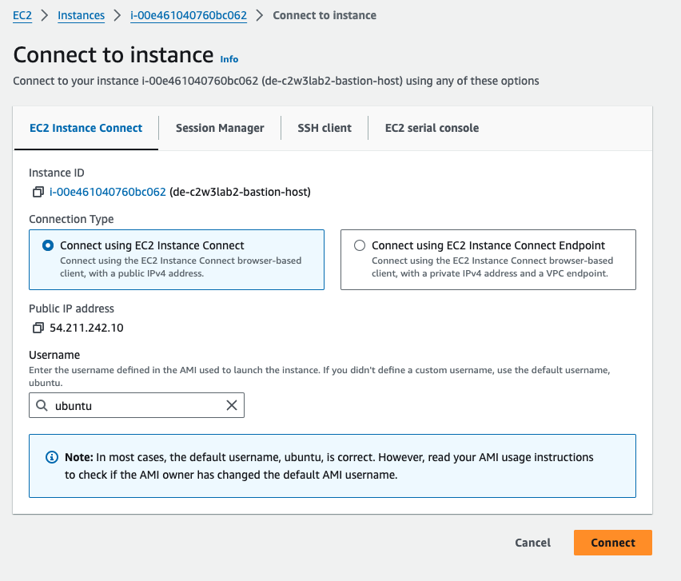
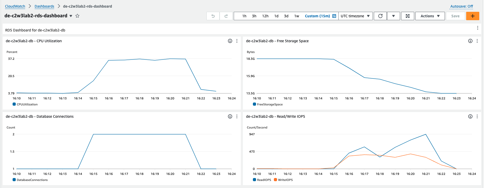
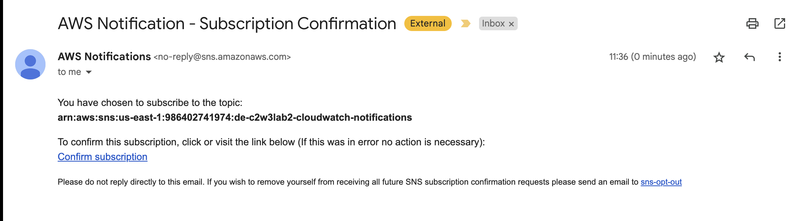
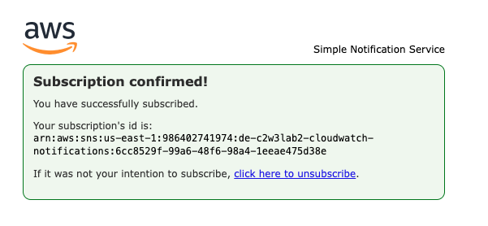
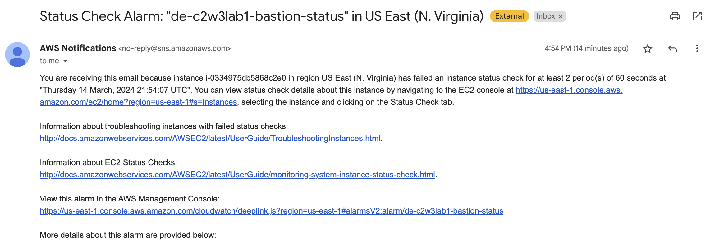

# Week 3 Optional Lab:<br>Implementing Monitoring with Amazon CloudWatch

In this lab, you will use Amazon CloudWatch tools to monitor a bastion host architecture.

## 1 - Introduction

Your team is responsible for designing, developing and deploying database instances 
via a bastion host (also known as a jump server). This intermediary server acts 
as a gateway, allowing secure access to other servers within a private 
network. A new requirement has come from leadership to your team, they want 
to closely monitor the architecture and set up an alarm in case the bastion 
host fails. Your task for this lab is to learn more about the monitoring 
tools provided by Amazon CloudWatch while working with a similar architecture 
as the previous lab.

The infrastructure consists of the following components:

- `VPC`: A [Virtual Private Cloud](https://docs.aws.amazon.com/vpc/latest/userguide/what-is-amazon-vpc.html) 
in which your solution will reside.
- `EC2`: A virtual instance that will work as a bastion host on a 
public subnet.
- `RDS`: A relational database instance that will reside in a private subnet group.
- `Public Subnets`: [Subnets](https://docs.aws.amazon.com/vpc/latest/userguide/configure-subnets.html) 
inside the VPC with internet access.
- `Private Subnets`: Subnets inside the VPC without internet access.


## 2 - Infrastructure deployment using Terraform

The first step in this lab will be setting up the infrastructure using 
Terraform. In your Cloud9 terminal, change the working directory to the `terraform` folder:

```bash
cd terraform
```

and then, run the initialization command:

```bash
terraform init
```

Execute the following command to generate the execution plan:

```bash
terraform plan
```

To deploy infrastructure, run the command

```bash
terraform apply
```

Type `yes` and you will see the process of resources creation. This process will 
take around 7-10 minutes.

You are already familiar with this infrastructure. There are only some small 
changes: one is the user data installing some packages in your bastion host; 
the second one is in your RDS in which the performance insights to monitor 
your Database has been enabled. 
To check that, open the `terraform/modules/bastion_host/rds.tf`  file and at 
the `resource "aws_db_instance" "database"` you will see a new key 
named `performance_insights_enabled` set as true, which allows you to keep 
track of several metrics in your RDS.

## 3 - Test the Infrastructure

Once the infrastructure has been deployed successfully, you will connect to 
the database using the bastion host. You can get the database endpoint from the 
previous output or running the command:

```bash
terraform output db_host
```

This command will output the password (all of the outputs are in double quotes):

```bash
terraform output db_master_password
```

In order to connect to the bastion host, there are several options such as:
- Connecting directly to the bastion host using SSH.
- Creating an SSH tunnel connection to the bastion host from your development environment.

In particular, you will connect through the SSH tunnel as it is a more elegant 
way to connect to a remote server. Now, let's create the SSH tunnel connection. 

Execute the following command, replacing
- `<RDS-HOST>` with the output from the command `terraform output db_host`,
- `<DATABASE-PORT>` with the output from the command `terraform output db_port`,
- `<BASTION-HOST-DNS>` with the output from the command `terraform output bastion_host_dns`.

Make sure that you run it from the `terraform` folder.

```bash
ssh -i de-c2w3lab2-bastion-host-key.pem -L 5432:<RDS-HOST>:<DATABASE-PORT> ubuntu@<BASTION-HOST-DNS> -N -f
```
Confirm the connection by typing in `yes` and pressing `Enter`.

Move back to the parent directory:

```bash
cd ..
```

With the tunnel configured, you can access the RDS by using this command:

```bash
psql -h localhost -U postgres_admin -p 5432 -d postgres --password
```

You will be prompted to write down the database password
which is an output from the command `terraform output db_master_password` 
(do not include the double quotes!). Then, execute the following command:

```sql
CREATE DATABASE sbtest;
```

You will use this database later so do not log out or do not close this terminal.

To exit the attempt either press `Ctrl+S` (it also might be `Cmd+S`, `Ctrl+Q` or 
`Ctrl+C` or typing `quit` and pressing Enter).

## 4 - CloudWatch Logs and Metrics

Amazon CloudWatch is a comprehensive monitoring and observability service. It 
provides a unified view of operational health and performance across 
AWS resources and applications enable effective monitoring, logging, and alerting. 
To showcase the Cloudwatch capabilities, you are going to create a Cloudwatch 
dashboard to show some metrics from the deployed RDS. 

### 4.1 - CloudWatch Showcase

Open a new Cloud9 terminal and go back to the terraform folder:

```bash
cd ~/environment/terraform
```

Open the `main.tf` file from the `terraform` folder. Uncomment the module named 
`monitoring` (lines 13 to 20). Save changes to the file.

Then, in the `terraform/modules/monitoring` folder, open the `cloudwatch.tf` file and 
uncomment only the resource `"aws_cloudwatch_dashboard" "rds_dashboard"` (lines
1 to 94). You can use hotkeys `Ctrl+/` or `Cmd+/`. Save changes to the file.

In this resource, there is a key named `dashboard_body`; 
this is where you define the position, size and content of the dashboard elements. 
Inspect this key, you will find some widgets of text type, 
like the title of the dashboard, and other widgets of metric type. Between the 
metrics that you are going to monitor you can find the CPU Utilization, Free 
Storage Space, Read/Write IOPS and the number of Database Connections in your RDS. 
Those metrics are shown as an average over a window of 30 seconds.
In your Cloud9 terminal, deploy your new resources with the following commands:

```bash
terraform init
terraform plan
terraform apply
```

Remember to write `yes` to apply the changes. Now, in the AWS console, search 
for **Cloudwatch**, and click on **Dashboards** button in the left panel. You 
will find the dashboard that you just deployed.




Open your dashboard and you will see the four metrics that were created.




You can export those metrics to Cloudwatch and add those metrics to the dashboard. 
You can find more information on this 
[AWS video tutorial](https://www.youtube.com/watch?v=YLIzUrXRzd0).


### 4.2 - Monitoring your Metrics

To monitor your metrics, you are going to perform some tests with a tool 
named [`sysbench`](https://github.com/akopytov/sysbench). Sysbench is a popular 
open-source benchmarking tool designed to evaluate the performance of various 
system components, including databases like PostgreSQL. It is particularly useful 
for stress testing and performance tuning. Sysbench can benchmark CPU, memory, 
file I/O, and database performance. It also supports multiple databases, 
including MySQL, PostgreSQL, and Oracle. You are provided in an installation 
of `sysbench` in your bastion host. 

Go back again to the AWS console and search for **EC2**. In the left panel, click 
on **Instances**. Search for your bastion host instance `de-c2w3lab2-bastion-host` 
and click on its ID. Then, click on **Connect**.





You will be prompted to the terminal to interact with your bastion host.

Let's perform a first test by executing the following command in your bastion 
host terminal. Make sure to fill the placeholders with the necessary information:

```bash
sysbench /usr/share/sysbench/oltp_insert.lua \
  --db-driver=pgsql \
  --table-size=1000000 \
  --tables=15 \
  --threads=1 \
  --pgsql-host=<RDS-HOST> \
  --pgsql-port=5432 \
  --pgsql-user=postgres_admin \
  --pgsql-password=<DB-PASSWORD> \
  prepare
```

Let's understand what this command does and the options used:
- `--table-size=1000000`: Sets the size of each OLTP (Online Transaction Processing) 
    table to 1.000.000 rows. This defines how many rows will be inserted into each 
    table during the preparation phase.
- `--tables=15`: Specifies the number of OLTP tables to be created. 
    In this case, 15 tables will be created.
- `--threads=1:` Defines the number of threads to use. Here, only one thread is being used.
- `/usr/share/sysbench/oltp_insert.lua`: This is 
the path to the Lua script that Sysbench will execute. The `oltp_insert.lua` 
script is used to prepare the database by creating the necessary tables and populating them with data.
`prepare`: The action to perform. In this case, it tells Sysbench to prepare the database.

This command connects to a PostgreSQL Database, and executes the `oltp_insert.lua` 
to prepare the database by creating 15 OLTP tables, each one with one million rows.

Execute the previous command and go back to your Cloudwatch Dashboard to monitor 
the state changes of your defined metrics. You should see a peak in the CPU 
Utilization and Read/Write IOPs charts, while the Free Storage Space will start 
decreasing. This setup can take between 5 to 7 minutes. 




## 5 - Monitoring your Architecture with CloudWatch Alarms

### 5.1 - Creating the Alarms

Now, go back to Cloud9 and open the `terraform/modules/monitoring/cloudwatch.tf` file. 
Uncomment the resources associated with the **Alerts** (lines 97 to 123). Save
changes. 

This is the description of the recourses:
- `aws_cloudwatch_metric_alarm`: This resource creates a CloudWatch alarm that 
    monitors the status of a bastion host instance in EC2.
- `aws_sns_topic`: This resource creates an SNS topic to send notifications 
    when the CloudWatch alarm is triggered.
- `aws_sns_topic_subscription`: This resource creates a subscription to the SNS 
    topic, allowing notifications to be sent to an email address.

Make sure to only uncomment those 3 resources; the RDS Alert must remain 
commented as you will work on that later.

Open the `terraform/variables.tf` file and search for the variable 
named `notification_email`. In the default key, write down your e-mail replacing
the placeholder `<EMAIL-FOR-MONITORING>`. 
This e-mail will be used to send you notifications and alerts.

Then, deploy the new infrastructure:

```bash
terraform plan
terraform apply
```

Once those resources have been deployed, a subscription should be sent to 
the e-mail that you added as the notification mail.





Monitoring your infrastructure is a vital part of keeping it reliable and it 
allows you to detect failures early and bring the system back online after 
any unforeseen issue. In this lab, the `monitoring` module created a CloudWatch 
alarm to keep a check on the health of the bastion host and an SNS topic and 
subscription to send an email in case the alarm is triggered. The subscription 
you accepted before was to this SNS topic, when the bastion host fails you should
get a notification.

You will artificially trigger an alarm by shutting the network interface of the 
bastion host.

Go to the terraform directory:

```bash
cd terraform
```

Get bastion host DNS:

```bash
terraform output bastion_host_dns
```

Now run the following command replacing the `<BASTION-HOST-DNS>` placeholder:

```bash
ssh -i de-c2w3lab2-bastion-host-key.pem ubuntu@<BASTION-HOST-DNS> sudo ifconfig ens5 down
```

*Note*: there will be an empty line as an output from this command.

The alarm will take some time to trigger, but **after about 10 minutes** you should 
have received an email with the details of the alarm. Such as this:



Stop the command run by pressing `Ctrl+S` (it also might be `Cmd+S`, 
`Ctrl+Q` or `Ctrl+C`). 
Once you receive the notification, go to the AWS console, search for EC2, select your 
bastion host and click on **Instance State**; then, click on Reboot.

#### 5.2 - Creating New Alerts for RDS

Now, you are going to create a new alert for your RDS instance. Open 
the `terraform/modules/monitoring/cloudwatch.tf` file, uncomment the last section
(lines 125 to 142) and complete the code associated with the resource `RdCpuUsage`: 

- Set the number of evaluation periods to 2.
- You will check the CPU Utilization. The associated metric name is `"CPUUtilization"`.
- Set the period to `"60"` seconds.
- Your CPU utilization threshold is 20%. Set the `threshold` key to "20".

Don't forget to save the changes. Then, deploy your new resources with:

```bash
terraform plan
terraform apply
```

Connect again to your bastion host to create a new sysbench test with the following command. You will 
need to replace the placeholders `<RDS-HOST>` and `<DB-PASSWORD>` with the corresponding values.

```bash
sysbench /usr/share/sysbench/oltp_read_write.lua \
  --db-driver=pgsql \
  --report-interval=5 \
  --table-size=1000000 \
  --tables=15 \
  --threads=64 \
  --time=300 \
  --pgsql-host=<RDS-HOST> \
  --pgsql-port=5432 \
  --pgsql-user=postgres_admin \
  --pgsql-password=<DB-PASSWORD> \
  --pgsql-db=sbtest \
  run
```

This script will mimic some real-world OLTP transactions over the database. 
In this case, the options used are the following:
* `--report-interval=2`: Sets the interval (in seconds) at which Sysbench will 
    report intermediate results.
* `--threads=64`: Specifies the number of threads used in the test. This will 
    increase the number of simultaneous database connections.
* `--time=300`: The duration of the test in seconds.
* `oltp_read_write.lua`: These scripts simulate an OLTP workload. It executes a mix of read 
    and write operations to simulate this real-world workload composed of 
    read (`SELECT`), write (`INSERT`) and update/delete operations.

This test will last for 5 minutes. You can check your dashboard to see the increase 
in CPU Utilization. Furthermore, a new notification should be sent to your 
e-mail reporting that the CPU usage has reached the threshold you expected.


## 6 - Tear Down your Infrastructure

Another important advantage of using an IaC tool to manage your infrastructure 
is that you can easily destroy some resources or even tear down your whole 
infrastructure. The cleaning process is easier to perform when you are not going
to use a certain infrastructure anymore. To do so, check that you are in the 
`terraform` directory and run the following command:

```bash
terraform destroy
```  

Execute the command in the terminal to clean up the unwanted resources. 
You will see the execution plan for the destruction process and will be asked 
for confirmation. Answer `yes` to perform the cleanup process.

Congratulations! In this lab, you've successfully implemented DataOps 
principles using Terraform as an Infrastructure as Code (IaC) tool to 
create some monitoring and alerting resources, such as an Amazon CloudWatch dashboard 
and notifications to your email to check the status of your resources.