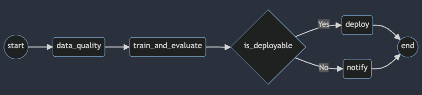

# Week 4 Assignment: Building an Advanced Data Pipeline With Data Quality Checks

This time you will support the Machine Learning team in building a Machine 
Learning pipeline for three fictitious Mobility-As-A-Service vendors 
(Alitran, Easy Destiny, and ToMyPlaceAI). This pipeline consists of 
preprocessing and validating data to train a model to estimate the ride duration 
and decide if the model is suitable for deployment based on training metrics. 
The continuous training and evaluation of the model will allow each vendor to 
improve the ride duration estimation service.

**After this assignment you'll be able to:**

- Implement a DAG using Taskflow API.
- Use Great Expectations to perform quality checks in your DAG.
- Employ the `BranchPythonOperator` within a DAG to determine the path of the 
workflow based on a condition.
- Construct multiple dynamic DAGs based on configuration files.

## 1 - The DAG Details

In this assignment, you will implement a DAG to validate data, train and evaluate 
a model, and decide to deploy it or notify low performance. Then you'll generalize 
this DAG as a template to create Dynamic DAGs for different
vendors.

This is the DAG diagram which you will be using:




The following are the descriptions of the tasks that constitute the DAG:

- `start`: an empty task marking the start of the DAG. It doesn't include any behavior.
- `data_quality`: triggers a data quality check on the data using the 
`@task.virtualenv` decorator from the TaskFlow API.
- `train_and_evaluate`: trains and evaluates a model to estimate ride duration 
and returns the performance metric.
- `is_deployable`: decides whether to deploy a model based on the model performance.
- `deploy`: prints a deployment message to simulate the deployment process of the model.
- `notify`: prints a notification message to simulate the notification for a 
low-performance model.
- `end`: an empty task marking the end of the DAG. It doesn't include any behavior and 
will be executed with the `DummyOperator`. However, here the default value `all_success`
of the parameter `trigger_rule` will be changed to `none_failed_or_skipped`. The rule 
specifies that the end task should be triggered if at least one upstream task has succeeded.
But it's okay if some upstream tasks fail, as long as not all of them do.

> **Note:** For educational purposes, the proposed DAG uses _pandas_, _SciPy_, 
> _Great Expectations_, and _NumPy_ to handle the data within the Airflow instance. 
> This is not desirable in real-life Airflow pipelines for the following two reasons:
>
> 1. Airflow should interact with storage and processing solutions using operators 
> specifically designed for them.
> 2. Airflow should only be an orchestrator, and it should delegate the actual 
> processing workload of the pipeline to the appropriate tools such as databases 
> or Spark clusters.

## 2 - Setting Up Airflow's Components

You are provided with a dockerized deployment of Airflow, already running on an 
EC2 instance. You will only interact with the Airflow UI and the DAG directory, 
which is an S3 bucket. 

2.1. To access your Airflow UI, go to the AWS console and search for 
**CloudFormation**. You will see two stacks deployed, one associated with your 
Cloud9 environment (name with prefix `aws-cloud9`) and another named with an 
alphanumeric ID. Click on the alphanumeric ID stack and search for the 
**Outputs** tab. You will see the key `AirflowDNS` with the complete URL to 
access the Airflow UI in the **Value** column. Copy it and paste it into another 
browser tab. You will see a login page, use the following credentials:

- username: `airflow`
- password: `airflow`

> **Note:** It might happen that you won't see a login screen straight away. 
> As the Airflow's components deployment can take several minutes, it is possible 
> that the first time you copy the URL, the service will not be yet available. 
> You can continue working on the following exercises in Cloud9 and refresh the 
> Airflow UI tab in a few minutes to see the login screen.

2.2. Review the **Outputs** of the deployed stack in **CloudFormation**. 
There are other values you will need for the assignment.

Similarly to the previous lab, you'll be using _Raw Data Bucket_ to write code,
create and delete files, and _DAGs Bucket_ to upload the file defining the DAG
(which will be recognized by Airflow). Check the names of those two buckets
in the CloudFormation Outputs.

In case your Apache Airflow environment presents any issues, you can always 
restart it by running the following bash script:

```bash
bash ./scripts/restart_airflow.sh
```

This process will end when the service is healthy. That should take less than 3 minutes.

## 3 - Preprocessing the Data

The first task in any Machine Learning pipeline is to preprocess the data. In
this assignment, the data has been already preprocessed and partitioned by the 
vendor name and then divided into train and test sets as parquet files. Right now, 
you count on the train and test splits to build an ML model in your 
_Work Zone_ of the _Raw Data Bucket_. 

3.1. In your Cloud9 environment, check the `data` folder. There you will see the 
following structure

- `"work_zone/data_science_project/datasets/<VENDOR_NAME>/train.parquet"`
- `"work_zone/data_science_project/datasets/<VENDOR_NAME>/test.parquet"`

Where the placeholder `<VENDOR_NAME>` can be any of the following values: 
- `easy_destiny`
- `alitran`
- `to_my_place_ai`

3.2. This is the data that the ML team provided you. You need to store it in the 
_Raw Data Bucket_. For that, in the Cloud9 terminal change your working directory 
to `data` and execute the `aws s3 sync` command replacing the placeholder
`<RAW-DATA-BUCKET>` with the _Raw Data Bucket_ name (see the `Value` column in the 
CloudFormation). Then go back to the original directory.

```bash
cd data
aws s3 sync work_zone s3://<RAW-DATA-BUCKET>/work_zone/
cd ..
```

3.3. Inspect your bucket with the following command (please, replace the placeholder
`<RAW-DATA-BUCKET>` with the _Raw Data Bucket_ name):

```bash
aws s3 ls s3://<RAW-DATA-BUCKET>/work_zone/ --recursive
```

Now you will need to create a data pipeline that will perform some quality checks 
and then train a custom model for each vendor because each one operates in a 
different country and has particular quality requirements. 

## 4 - Creating the DAG and its Tasks

### 4.1 - Checking Data Quality

Data quality is the measure of the suitability of data to be used for its 
intended purpose. It is usually thought of as comprising several 
[dimensions](https://www.collibra.com/us/en/blog/the-6-dimensions-of-data-quality), 
with the most common being:

- **Accuracy:** The level to which data reflects the real-world scenarios and 
events and can be confirmed through verifiable sources.

- **Completeness:** The degree to which the data carry all of the desired 
information.

- **Consistency:** The absence of conflicts between versions of the same data 
stored in different locations.

- **Validity**: Adherence of the data to an expected set of rules, which may 
come from physical, mathematical, statistical, or business-related restrictions.

- **Uniqueness:** The absence of duplicate or overlapping values within a single 
copy of the data.

- **Timeliness:** The ability to have the data available and sufficiently 
up-to-date when it is to be used.

A tool that allows you to solve these problems is **Great Expectations** (GX),
which was covered in Week 3 of this Course. 

The business establishes that no vendor can report services to more than 6 
passengers in a single trip, so you should not train a model if the data does not 
meet this criterion. The validation can be done on the `passenger_count` column
of the data using the 
[`GreatExpectationsOperator`](https://registry.astronomer.io/providers/airflow-provider-great-expectations/versions/0.2.7/modules/GreatExpectationsOperator).

You will need to complete the Python scripts which can be found in the folder 
`src/`. At the end of the assignment, you'll upload the files to the appropriate 
bucket so that you can run your DAG with the Airflow UI.

Open the file `src/model_trip_duration_easy_destiny.py`. The script defines the DAG 
you'll use to orchestrate the continuous training pipeline. 

### Exercise 1

1. Create a variable from the Airflow UI. Select the **Admin** tab in the 
header, select the **Variables** option. Click the add button **+** and complete 
the variable with the following values:
    - `Key`: `bucket_name`,
    - `Val`: name of the _Raw Data Bucket_. 

    Click on **Save**.

2. Complete the definition of the `GreatExpectationsOperator` in the section 
associated with the `EXERCISE 1`. You will need to specify the asset name for the 
check, execution engine and some other parameters. You can explore the 
expectation suite in the file `dags/gx/expectations/de-c2w4a1-expectation-suite.json`
of the _DAGs Bucket_.

### 4.2 - Training and Evaluating the ML Model

You already have a task that allows you to assess data quality. Now you will 
create one to trigger a training and evaluation process. For that, you will use 
the TaskFlow API.

You will train a linear regression model to predict the trip duration in a ride 
service. Then measure its error using the root-mean-square error (RMSE) on the 
test data. Finally, you will configure this task to return the model performance. 
This performance will be critical for downstream tasks in the pipeline.

In this assignment, the Airflow instance will compute the training process. 
Remember that Airflow is an orchestrator, and high-load tasks like this one must 
run into other machines to trigger them with Airflow.

### Exercise 2

Complete the `train_and_evaluate` task in the section associated with the 
`EXERCISE 2`. Then complete the code by following the instructions in each code 
chunk starting with the comment `### START CODE HERE ###`` (2 sections). This task 
will

- Read the train and test splits for Easy Destiny (`easy_destiny`) based on the 
input parameter `vendor_name`.
- Return the RMSE `performance` to be used by the next task.

### 4.3 - Branching the ML Model

There might be scenarios where you need certain tasks in a data pipeline to run 
conditionally; that is, they would or would not be executed depending on whether 
some particular conditions are met. This behavior can be achieved in Apache
Airflow with [branching](https://airflow.apache.org/docs/apache-airflow/1.10.13/_api/airflow/operators/branch_operator/index.html), which can make a pipeline follow only certain paths of the DAG while omitting others.

Branching is performed in Airflow through the 
[`BranchPythonOperator`](https://airflow.apache.org/docs/apache-airflow/stable/_api/airflow/operators/python/index.html#airflow.operators.python.BranchPythonOperator).
It is similar to the `PythonOperator`, but the Python callable it refers to must 
return a specific task ID or a list of task IDs indicating which of the directly 
dependent tasks will be executed. Any tasks that are directly downstream but
whose IDs are not returned by the Python function will be skipped.

### Exercise 3

Complete the section associated with the `EXERCISE 3` in the file 
`src/model_trip_duration_easy_destiny.py`. You will need to define the function 
`_is_deployable` and use it in the `is_deployable`.

### 4.4 - Defining the DAG Dependencies

Let's define our task dependencies. Remember task dependencies are declared using 
the `>>` operator, with a statement like `A >> B` meaning that task `A` should 
be executed and finished before starting task `B`. But if you are using the
TaskFlow API, this is a little different. For instance, if you have task A 
with one input parameter `name` having a default value of `martin` and
and the task `B` without any input parameter, you must define dependencies in 
this way `A(name="martin") >> B()`.

### Exercise 4

In the `src/model_trip_duration_easy_destiny.py` file complete the section 
associated with the `EXERCISE 4`. You will need to declare the dependencies to 
replicate the desired DAG using previously defined tasks and operators. Make 
sure that you use the task names, not the method names (e.g. `is_deployable_task`, 
not `_is_deployable`).

## 5 - Dynamic DAGs

You may remember the **DRY principle** of software development. It stands for 
"don't repeat yourself", and it reminds us that we should strive to avoid 
code repetition as it makes software harder to maintain and more susceptible to 
the introduction of bugs. Since you declare the data pipelines as code, 
the same principle applies to Airflow DAGs. However, it is not uncommon to 
encounter the necessity of having DAGs for very similar pipelines that vary 
only in a few inputs or parameters. In these cases, instead of writing one 
DAG for each pipeline and having a lot of repeated code, you should harness the
power of 
[**dynamic DAGs**](https://airflow.apache.org/docs/apache-airflow/2.8.3/howto/dynamic-dag-generation.html) 
so that you can generate multiple similar DAGs from just a couple of code
files and possibly some configuration files with no duplicate code.

There are several ways to generate DAGs dynamically. The one you will use here 
employs the [Jinja library](https://jinja.palletsprojects.com/) to replace some
placeholders in a template DAG to generate DAGs according to the parameters 
specified in JSON configuration files. Jinja is the same templating engine used 
by Airflow for other purposes.

### 5.1 - Creating the Template File

You need to have DAGs for _To My Place AI_ and _Alitran_ that will be very 
similar to the one you wrote for _Easy Destiny_. This is a good use case for 
dynamically generated DAGs, so you will turn the DAG you wrote into a Jinja
template that can work for any of the three vendors when replacing the 
appropriate placeholders.

5.1.1. Copy the contents of the file `src/model_trip_duration_easy_destiny.py` 
into a new file `src/templates/template.py`. You can use the following 
command:

```bash
cp src/model_trip_duration_easy_destiny.py src/templates/template.py
```

5.1.2. In the `template.py` file replace each occurrence of the DAG name 
`model_trip_duration_easy_destiny` with the Jinja template: `{{ dag_name }}` 
(it should be done in 3 places in the code). It doesn't matter if it's a function name or 
even a string, using Jinja you will be able to add the correct name.

5.1.3. Replace each occurrence of the vendor name `easy_destiny` in the DAG with the 
Jinja template `{{ vendor_name }}` (it should be done in 4 places in the code).

You created the template based on the script from the previous exercises. 
The only differences for each of the three vendors are the _DAG name_ and 
_vendor name_. 

### 5.2 - Creating the configuration files

The configuration files are the sources to generate the new DAGs based on the 
template. Each new config file will represent the variables of a single new DAG 
by defining key-value pairs for each of the template variables. Therefore,
you will end up with as many config files as Dynamic DAGs you want to create and
as many key-value pairs as dynamic template variables (`{{ example }}`). In this 
case, you have to create a dag for each of our 3 vendors 
(`easy_destiny`, `alitran`, and `to_my_place_ai`).

5.2.1. In the Cloud9 terminal, create the following folder:

```bash
mkdir -p src/templates/dag_configs
```

5.2.2. In the folder `src/templates/dag_configs` create three configuration files 
called `config_easy_destiny.json`, `config_alitran.json` and 
`config_to_my_place_ai.json`.

5.2.3. Copy and paste the following JSON data into each of the files,
replacing the placeholder `<VENDOR_NAME>` with the appropriate vendor
(`easy_destiny`, `alitran` or `to_my_place_ai`)

```JSON
{
  "dag_name": "model_trip_duration_<VENDOR_NAME>",
  "vendor_name": "<VENDOR_NAME>"
}
```

### 5.3 - Generating the DAGs

Now that you have the template and the configuration files, you will need to 
produce the Dynamic DAGs by creating and running a script to do it. 
The script called `generate_dags.py` allows you to produce the DAG files 
using the `template.py` and configs. Open the `generate_dags.py` that is also 
located in the `src/templates` folder.

As you can see, the script reads the `template.py`, then detects each JSON 
configuration that matches the pattern `config_*.json` to iterate over them. 
On every iteration, the generator reads one config file and attempts to replace 
all Jinja expressions in the template script. However, each of the config file 
only defined two of the Jinja expressions - `vendor_name` and `dag_name`, 
while the others, such as `{{ var.value.bucket_name }}` are not defined in the 
config file and are expected to be replaced at the runtime of the DAG. The 
generator will skip those expressions wrapping them like 
`{{ var.value.bucket_name }}`, which can be considered as 
protection of the expressions not defined in the config file. After that 
the iteration block declares the filename `"dags/{config['dag_name']}.py"` 
using the `dag_name` parameter, renders the `template_str` in `content` and writes 
or overwrites the `content` as a new file.

5.3.1. In the Cloud9 terminal, go to the `src/templates` folder:

```bash
cd src/templates
```

5.3.2. Generate the dynamic dags by running the file `generate_dags.py` with the command:  

```bash
python3 ./generate_dags.py
```

The three dags will be generated in the `src/dags/` folder. 

5.3.3. Get back to the environmental folder:

```bash
cd ../..
```

## 6 - Running the DAGs with Airflow

Synchronize the `src/dags` folder with the _DAGs Bucket_ name by using 
the following command. The _DAGs Bucket_ name can be found in the `Value` column 
of CloudFormation outputs:

```bash
aws s3 sync src/dags s3://<DAGS-BUCKET>/dags
```

Once the DAGs are copied to your _DAGs Bucket_, go to the Airflow UI. Refresh the web 
interface, you should see that it recognizes the three DAGs (it may take from 2 to 
10 minutes). Click on the toggle button and let each dag run. These are the expected 
results for each dag id:

- **model_trip_duration_alitran:** it will notify the model was not deployed.
- **model_trip_duration_easy_destiny:** it will deploy the model.
- **model_trip_duration_to_my_place_ai:** it will fail the checkpoint in _Great Expectations_.

**Note:** It is suggested to run these dags one by one as the Great Expectations task requires to access the documentation's files, and if all dags try to do it at the same time may they may incur in some unnecessary retries for this task.

If the tasks didn't succeed, use the logs to find the
problem and return to the `template.py` script to correct and rebuild the dynamic DAGs. 

> **Note:** The DAG `model_trip_duration_to_my_place_ai` will 
> "fail successfully", because the data will not pass the data quality check.

If your runs didn't succeed the first time, in the practice labs of this week you 
can find some instructions on how to detect the source of the problem. 
If you have updated the code and want to restart the DAGs, go to Airflow's web 
interface and navigate to the **Browse** > **DAG Runs** page. There you can 
delete the failed runs so that Airflow performs them again.

In this assignment, you built an advanced data pipeline and automated 
quality assurance processes with Apache Airflow and Great Expectations. 
You created a pipeline for the continuous training, evaluation and
deployment of a Machine Learning model, configured a `GreatExpectationsOperator` 
to assess data quality. Afterwards, you performed branching operations based on the
model performance to decide whether to deploy the model or notify about low 
performance. And finally, you created Dynamic DAGs to manage data pipelines 
for different vendors following the DRY principle.
