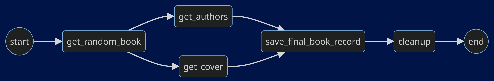
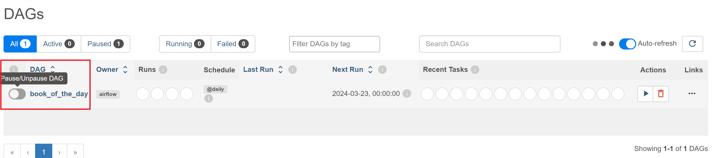
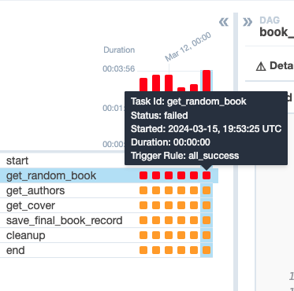
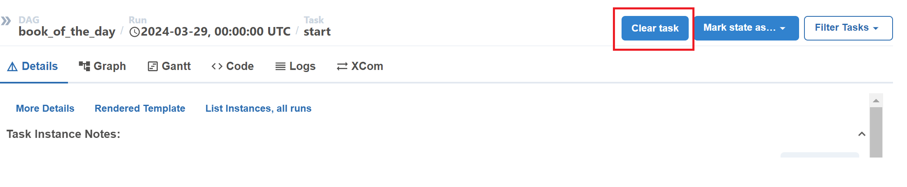
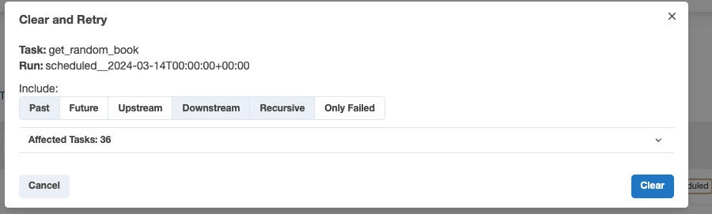
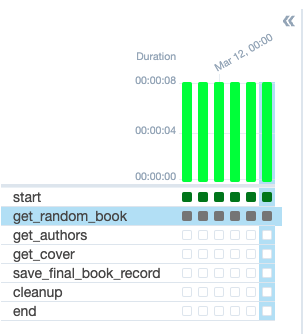
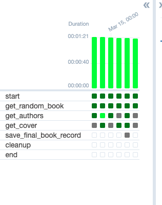

# Week 4 Lab 1:<br>Airflow 101 - Building your First Data Pipeline

In this lab, you will build your first DAG in Airflow using Python operators, 
visualize it in the Airflow UI and troubleshoot errors in the DAG. You will use a 
[dockerized](https://docs.docker.com/) version of Airflow running on an AWS EC2 
instance. 

If you get stuck with completing the code in the exercises, you can download the 
solution file `src_solution/book_of_the_day_solution.py` by running the following command 
in your Cloud9 environment:

```bash
aws s3 cp --recursive s3://dlai-data-engineering/labs/c2w4lab1-233848-solution/ ./
```

In case your Apache Airflow environment presents any issues, you can always 
restart it by running the following bash script:

```bash
bash ./scripts/restart_airflow.sh
```

This process will end when the service is healthy. That should take less than 3 minutes.

## 1 - Introduction

This week, you have learned about the basics of orchestration, what DAGs mean 
and how to build a simple DAG in 
[Apache Airflow](https://airflow.apache.org/docs/apache-airflow/stable/index.html). 
In this lab, you will implement your first data pipeline in Airflow and interact 
with its UI.

Assume you work as a Data Engineer at a fictitious company called 
_BookWormSapiens.com_, which posts book suggestions and discussions for book 
lovers and avid readers. You are tasked to develop the _Book of the Day_ feature, 
where you need to select a random book as the Book of the Day and portray it on 
the website. To accomplish this task, you will create an Airflow-orchestrated 
pipeline that uses the [Open Library Web APIs](https://openlibrary.org/developers/api) 
(books, authors and covers APIs) to fetch information about a random book, its 
authors and possibly a thumbnail of its cover. The pipeline will be scheduled 
to run every day.

## 2 - The DAG Details

In this lab, you will implement the following DAG:



The DAG consists of the following tasks:

- `start`: an empty task marking the start of the DAG. It doesn't include any 
  behavior.

- `get_random_book`: sends a request to the 
  [Open Library Books API](https://openlibrary.org/dev/docs/api/books) to fetch 
  information about a random book (such as the book title, version and subjects, 
  the keys or identifiers of its authors, and maybe the keys of its cover images). 
  In this task, you will save the returned information to a JSON file labeled 
  as `initial_info_<LOGICAL_DATE>.json` stored in an S3 bucket. The `logical_date`, 
  in the name of the JSON file, represents the start of the data interval. 
  This file is temporary and will be deleted in the `cleanup` task.

- `get_authors`: uses the authors' keys stored in the 
  `initial_info_<LOGICAL_DATE>.json` file to send the necessary requests to 
  the [Open Library Authors API](https://openlibrary.org/dev/docs/api/authors) 
  to fetch the names of the authors. In this task, you will save the returned 
  names to a JSON file labeled as `author_names_<LOGICAL_DATE>.json` stored in 
  an S3 bucket. This file is also temporary and will be deleted in the `cleanup` 
  task.

- `get_cover`: uses the covers' identifiers stored in the 
  `initial_info_<LOGICAL_DATE>.json` file, to send a request to the 
  [Open Library Covers API](https://openlibrary.org/dev/docs/api/covers) to 
  retrieve the book's first available cover image, and save it to the 
  `cover_<LOGICAL_DATE>.jpg` file in an S3 bucket. If no covers are available, 
  no file is saved.

- `save_final_book_record`: uses information from the 
  `initial_info_<LOGICAL_DATE>.json` and `author_names_<LOGICAL_DATE>.json` files, 
  and the link to `cover_<LOGICAL_DATE>.jpg` image (if it exists), to create 
  the final book record that will be kept to describe the Book of the Day. 
  You will save the final book record to a JSON file labeled as 
  `book_record_<LOGICAL_DATE>.json`stored in an S3 bucket.

- `cleanup`: deletes the intermediate files generated by the `get_random_book` 
  and `get_authors` tasks. The intermediate files are no longer needed after 
  the creation of the book record since they contain information about both 
  the book title and its authors' names.

- `end`: an empty task marking the end of the DAG. It doesn't include any behavior.

You will create the `start_task` and `end_task` using the 
[`EmptyOperator`](https://airflow.apache.org/docs/apache-airflow/stable/_api/airflow/operators/empty/index.html), 
and the rest of the tasks using the 
[`PythonOperator`](https://airflow.apache.org/docs/apache-airflow/stable/_api/airflow/operators/python/index.html).


> **Note:** For educational purposes, the proposed DAG uses `boto3` to interact 
with S3 and create/delete the necessary files. This is not desirable in 
real-life Airflow pipelines for the following two reasons:
>
> 1. Airflow should interact with storage and processing solutions using 
operators specifically designed for them (you can see the 
[documentation](https://airflow.apache.org/docs/apache-airflow-providers-amazon/stable/_api/airflow/providers/amazon/aws/operators/s3/index.html#airflow.providers.amazon.aws.operators.s3.S3FileTransformOperator)).
> 2. Airflow should only be an orchestrator, and it should delegate the 
actual processing workload of the pipeline to the appropriate tools such as 
databases or Spark clusters (Spark operators can be found 
[here](https://airflow.apache.org/docs/apache-airflow-providers-apache-spark/stable/operators.html)).

## 3 - Setting Up Airflow's Components

You are provided with a dockerized deployment of Airflow, already running on an 
EC2 instance. You will only interact with the Airflow UI and the DAG directory, 
which is an S3 bucket. 

3.1. To access your Airflow UI, go to the AWS console and search for 
**CloudFormation**. You will see two stacks deployed, one associated with your 
Cloud9 environment (name with prefix `aws-cloud9`) and another named with an 
alphanumeric ID. Click on the alphanumeric ID stack and search for the 
**Outputs** tab. You will see the key `AirflowDNS` with the complete URL to 
access the Airflow UI in the **Value** column. Copy it and paste it into another 
browser tab. You will see a login page, use the following credentials:

- username: `airflow`
- password: `airflow`

> **Note:** It might happen that you won't see a login screen straight away. 
As the Airflow's components deployment can take several minutes, it is possible 
that the first time you copy the URL, the service will not be yet available. You can continue working on the following exercises in Cloud9 and refresh the Airflow UI tab in a few minutes to see the login screen.

3.2. In this lab, you will interact with two S3 buckets:

- _Raw Data Bucket_: this is the intermediate storage that you will use to 
  store the intermediate and final data collected by the pipeline (i.e., 
  `initial_info_<LOGICAL_DATE>.json`, `author_names_<LOGICAL_DATE>.json` 
  and `book_record_<LOGICAL_DATE>.json`).
- _DAGs Bucket_: this is the DAG directory that you will use at the end of the 
  lab to upload the Python script defining your DAG. Airflow uses this directory 
  to recognize what DAGs you've created and enable you to visualize them in the 
  Airflow UI.
  Check the names of those two buckets in the 
  CloudFormation Outputs of the deployed stack.

## 4 - Creating the DAG and its Tasks

To orchestrate the _Book of the Day_ feature that randomly selects a book each 
day, you need to create, in a Python script, the Airflow DAG by defining its 
tasks using Airflow operators and clarifying their dependencies. The file 
`src/book_of_the_day.py` contains a partially defined DAG that you will complete 
in the following exercises.

Open the file `src/book_of_the_day.py`.

### 4.1 - Defining the DAG

You first need to define some variables and instantiate your DAG.

### Exercise 1

In the `book_of_the_day.py` file, search for the section associated with the 
`EXERCISE 1`. Complete the code replacing all `None` following the instructions 
in the code. You will need to replace the placeholder `<RAW-DATA-BUCKET>` with
the name of the _Raw Data Bucket_. Also, you will set the `start_date` parameter 
to start seven (7) days before the current date. The DAG `catchup` parameter is 
set to `True`, and choosing for `start_date` a previous date to the current date, 
Airflow will automatically run the DAG several times when you first activate it, 
to catch up on the missing runs.

### 4.2 - Getting the Information of a Random Book

In the first non-empty task of the DAG, you will fetch some initial information 
about a random book, by sending a request to the 
[Open Library Books API](https://openlibrary.org/dev/docs/api/books). To select 
a random book, you will generate a random book ID and include it in the API 
request. The Open Library Books API expects the book ID to be between `OL10001W` 
to `OL21000000W` (Open Library work ID).

The response from the API would look like as follows:

```json
{
  "title": "<BOOK_TITLE>",
  "authors": [
    {
      "author": {
        "key": "/authors/<ID_OF_AUTHOR_1>"
      },
      "type": {
        "key": "/type/author_role"
      }
    },
    {
      "author": {
        "key": "/authors/<ID_OF_AUTHOR_2>"
      },
      "type": {
        "key": "/type/author_role"
      }
    }
  ],
  "covers": ["<ID_OF_COVER_1_AS_INTEGER>", "<ID_OF_COVER_2_AS_INTEGER>"],
  "subjects": ["<SUBJECT_1>", "<SUBJECT_2>"],
  ...
}
```

You will save this JSON string without any changes to the 
`initial_info_<LOGICAL_DATE>.json` file in the _Raw Data Bucket_. 

### Exercise 2

In the section marked as Exercise 2 of the `book_of_the_day.py` file, complete 
the definitions of the `get_random_book` function and the `get_book_task`. Go 
through the comments in the code to understand the meaning of the code lines. 
Then complete the code replacing all `None` with the correct value, by 
following the instructions in each code chunk starting with the comment 
`### START CODE HERE ###` (3 sections). You might find useful the documentation 
of the `boto3` client method 
[`put_object()`](https://boto3.amazonaws.com/v1/documentation/api/latest/reference/services/s3/client/put_object.html).

> **Note**: what does the argument `context` that is passed into `get_random_book` 
function represent? Airflow has a set of 
[built–in variables](https://airflow.apache.org/docs/apache-airflow/stable/templates-ref.html) 
that contains information about the DAG that is currently running and its 
environment (like the DAG run's logical date). This information is stored in a 
dictionary called Airflow context, and for you to access it, you need to pass 
it to a task function. So `context` represents this dictionary that you can use 
to access the DAG run's logical date.

### 4.3 - Creating a Helper Function

Before you define the next tasks, you'll need to define a helper function that 
downloads the data from the file  `initial_info_<LOGICAL_DATE>.json` that you 
have created in the `get_random_book` task. You will use this helper method in the 
subsequent tasks.

### Exercise 3

In the section marked as Exercise 3 of the `book_of_the_day.py` file, complete 
the definition of the `get_initial_info_dict` helper function. Complete the code 
replacing all `None` with the correct value, by following the instructions 
in each code chunk starting with the comment `### START CODE HERE ###` (2 sections).

### 4.4 - Getting the Authors' Names

The initial information you extracted from the book API in the previous task 
doesn't include the authors' names. In this task, you will extract the name(s) 
of the author(s) of the selected book, by sending the necessary requests to the 
[Open Library Authors API](https://openlibrary.org/dev/docs/api/authors). 

The response from the API would look like as follows:

```json
{
  "name": "<AUTHOR_NAME>",
  "birth_date": "<YEAR_OF_BIRTH_AS_INTEGER>",
  ...
}
```

From this response, you will extract the names of the authors and save them 
to the `author_names_<LOGICAL_DATE>.json` file in the _Raw Data Bucket_. 
You will store the names of the authors as a list as follows:

```json
["<AUTHOR_NAME_1>", "<AUTHOR_NAME_2>", "<AUTHOR_NAME_3>"]
```

If the book information does not contain any authors, you will save an empty 
list.

### Exercise 4

In the section marked as Exercise 4 of the `book_of_the_day.py` file, complete 
the definitions of the `get_author_names` function and the `get_authors_task` 
Airflow task. Replace all `None` with the correct value, by following the 
instructions in each code chunk starting with the comment `### START CODE HERE ###` 
(3 sections).

### 4.5 - Getting the Cover Image

In this task, you will try to get a cover image of the book and save it to 
the _Raw Data Bucket_. The initial information you extracted from the book API 
may include a `"covers"`key pointing to a list of integers. These integers are 
the IDs of the cover images available for the book in the 
[Open Library Covers API](https://openlibrary.org/dev/docs/api/covers). In this 
task, you must make the appropriate call to this API to fetch the image 
corresponding to the first listed ID and save it to a file named 
`cover_<LOGICAL_DATE>.jpg`.

Many books in the Open Library database don't have any associated covers, so 
their initial information extracted from the book API won't include the 
`"covers"` key. In those cases, the task of "getting a cover image" should 
not perform any action.

### Exercise 5

In the section marked as Exercise 5 of the `book_of_the_day.py` file, complete 
the definitions of the `get_cover` function and the `get_cover_task`. Replace 
all `None` following the instructions in each code chunk starting with the 
comment `### START CODE HERE ###` (3 sections).

### 4.6 - Saving the Final Book Record

In this task, you will use the information collected in the 
`initial_info_<LOGICAL_DATE>.json` and `author_names_<LOGICAL_DATE>.json` files 
to create the final record that will be kept to describe the Book of the Day. 
You will also verify if the `cover_<LOGICAL_DATE>.jpg` file exists in the 
_Raw Data Bucket_ and, if it does, add the path to this image to the information 
stored in the final book record. The final record should look like as follows:

```json
{
  "title": "<BOOK_TITLE>",
  "authors": ["<AUTHOR_NAME_1>", "<AUTHOR_NAME_2>"],
  "cover_uri": "gs://<BUCKET_NAME>/cover_<LOGICAL_DATE>.jpg"
}
```

You will save the final record to a file named 
`book_record_<LOGICAL_DATE>.json` in the _Raw Data Bucket_.

### Exercise 6

In the section marked as Exercise 6 of the `book_of_the_day.py` file, 
complete the definitions of the `save_final_book_record` function and 
the `save_final_book_record_task`. Replace all `None` following the instructions 
in each code chunk starting with the comment `### START CODE HERE ###` 
(3 sections).

### 4.7 - Cleaning Up the Temporary Files

In this task, you will delete the `initial_info_<LOGICAL_DATE>.json` and 
`author_names_<LOGICAL_DATE>.json` temporary files. They are no longer needed 
since the final book record contains the needed information. Note that, if 
the `cover_<LOGICAL_DATE>.jpg` exists, you should not delete it, as the image 
itself is not kept in the JSON record and it is useful to portray the Book of 
the Day on the website.

### Exercise 7

In the section marked as Exercise 7 of the `book_of_the_day.py` file, complete 
the definitions of the `clean_up_intermediate_info` function and the `cleanup_task`. Replace all `None` following the instructions in each code chunk starting with the comment `### START CODE HERE ###` (2 sections).

### 4.8 - Marking the DAG's End

It is customary to mark the Airflow DAG's start and end with empty tasks. The 
`start_task` is already defined at the beginning of the task, but you must 
define the `end_task`.

### Exercise 8

In the section marked as Exercise 8 of the `book_of_the_day.py` file, complete 
the definitions of the `end` task using an empty operator and settings for its 
ID to `"end"`.

### 4.9 - Defining the DAG Dependencies

Now that you have defined all the tasks of your DAG, you now need to clarify 
their dependencies so that Airflow knows the appropriate order in which to run 
the pipeline's steps. Task dependencies are declared using the `>>` operator, 
with a statement like `A >> B` meaning that task `A` should be executed and 
finished before starting task `B`.

You need to define the dependencies among the tasks in such a way that Airflow 
recognizes the following DAG:


### Exercise 9

In the section marked as Exercise 9 of the `book_of_the_day.py` file, define 
the dependencies between the tasks according to the desired DAG. 

You will need to use the variable names for the Operator objects 
(`start_task`, `get_book_task`, etc.). This is described in details in the reading 
item "Best Practices in Writing Airflow DAGs" prior to this lab.

## 5 - Running Your DAG

After you've finished all the exercises, you now have your DAG completely 
defined in `book_of_the_day.py`. To upload the `book_of_the_day.py` file into 
the DAG directory _DAGs Bucket_ (notice this is not the same bucket as the 
_Raw Data Bucket_), run the following command (replace `<DAGS-BUCKET>` with 
the name of your _DAGs Bucket_):

```bash
aws s3 sync src s3://<DAGS-BUCKET>/dags
```

>**Note:** You may be wondering the difference between the `aws s3 cp` and the 
> `aws s3 sync` commands, here are some differences:
>
> - The `aws s3 cp` command is used to copy individual files or entire directories 
> from a local file system to an S3 bucket, or vice versa. It copies files one 
> time, without considering whether the source or destination files have 
> been modified since the last copy operation.
> - On the other hand, the `aws s3 sync` is used to synchronize the contents 
> of a local directory with an S3 bucket or synchronize between two S3 buckets. 
> It compares the contents of the source and destination and only copies files that 
> are new or have been modified since the last sync operation. It also deletes 
> files in the destination that don't exist in the source.

After you synchronize your local `dags` folder with the S3 bucket folder, go to 
the Airflow UI, which you opened in the step 3.1. You will see a list of the 
available DAGs, currently only one DAG should appear with the `book_of_the_day` 
identifier.

> **Note:** The DAGs list may take up to 5 minutes to refresh. If your DAG has 
> not appear immediately, click on the refresh button on the right-hand side 
> (just right the **Autorefresh** toggle) every 30 seconds or 1 minute.

You will also see on the left a toggle button to pause/unpause your DAGs.



Click on the toggle button to activate your DAG and then click on the DAG ID to 
go to the Grid view. Since the DAG has a start date in the past, Airflow should 
start its catchup process and perform the runs of the pipeline corresponding to 
the last few days. After a few seconds, all the missing runs should have been 
completed, have they?

Actually, you will see one of your tasks failing for all the runs. In the Grid 
view or Graph view, click on the failing task and search for the **Logs** tab. 
You will see some retries for the particular task and the logs for each of the 
attempts. Click on the last attempt's log and try to understand the issue.

You will see an output similar to this one:

```bash
[2024-03-18 23:14:35,760] Exporting env vars: AIRFLOW_CTX_DAG_OWNER='airflow' AIRFLOW_CTX_DAG_ID='learner_book_of_the_day' AIRFLOW_CTX_TASK_ID='get_random_book' AIRFLOW_CTX_EXECUTION_DATE='2024-03-18T23:14:14.039860+00:00' AIRFLOW_CTX_TRY_NUMBER='1' AIRFLOW_CTX_DAG_RUN_ID='manual__2024-03-18T23:14:14.039860+00:00'
[2024-03-18 23:14:35,761] SELECTED BOOK ID: works/OL19043851W
[2024-03-18 23:14:36,102] Task failed with exception
Traceback (most recent call last):
  File "/usr/local/airflow/.local/lib/python3.11/site-packages/airflow/models/taskinstance.py", line 433, in _execute_task
    result = execute_callable(context=context, **execute_callable_kwargs)
             ^^^^^^^^^^^^^^^^^^^^^^^^^^^^^^^^^^^^^^^^^^^^^^^^^^^^^^^^^^^^
  File "/usr/local/airflow/.local/lib/python3.11/site-packages/airflow/operators/python.py", line 199, in execute
    return_value = self.execute_callable()
                   ^^^^^^^^^^^^^^^^^^^^^^^
  File "/usr/local/airflow/.local/lib/python3.11/site-packages/airflow/operators/python.py", line 216, in execute_callable
    return self.python_callable(*self.op_args, **self.op_kwargs)
           ^^^^^^^^^^^^^^^^^^^^^^^^^^^^^^^^^^^^^^^^^^^^^^^^^^^^^
  File "/usr/local/airflow/dags/book_of_the_day_learner.py", line 62, in get_random_book
    assert response.status_code == 200, response.reason
           ^^^^^^^^^^^^^^^^^^^^^^^^^^^
AssertionError: Not Found
```

The error shows you that the status code of the API response is not 200, in other 
words, the requested endpoint was not found (i.e., a 404 status code). This 
means that there is an error in the requested URL you used in the `get_random_book` 
function. Open again the `book_of_the_day.py` file in the Cloud9 editor and 
search for the `get_random_book` function that threw the error. Search for the 
line where the API URL is built, it should look like this:

```python
response = requests.get(
            f"https://openlibrary.org/works/{book_id}.json"
        )
```

You will see that it depends on the `book_id`, so search for the line where this 
variable is defined:

```python
book_id = f"works/OL{random_book_id}W"
```

From the [API's documentation](https://openlibrary.org/dev/docs/api/books), 
here's an example of a valid API URL:

```python
"https://openlibrary.org/works/OL45804W.json"
```

You may now realize that the word `works` appears twice in the URL's path. 
You can delete it from either `book_id` or from the URL used in the `requests.get()` method, just remember to keep one of them.

Once you implemented the changes to fix the error, sync again the folder with 
the S3 DAGs bucket with the command:

```bash
aws s3 sync src s3://<DAGS-BUCKET>/dags
```

Go back to your Airflow UI and click on the Airflow logo to return to the 
DAGs list. Click on the refresh button on the right, just above the DAGs list. 
Click again on your DAG ID and in the Grid view click on the failed task of the 
last run:



Then click on the **Clear task** button in the right panel.



In the pop-up tab, click on **Past** and you will see that the number of 
Affected Tasks will increase, meaning that you will run all of those failed 
tasks. Then click on **Clear** and all your failed tasks should start running.



When your tasks are retrying again, the grid view should look like the following:



Now, your DAG runs should run properly. If they didn't succeed use the logs 
to try to find the problem and go back to the `book_of_the_day.py` file to 
correct it.



When you get successful runs, go to the _Raw Data Bucket_ (not the _DAGs Bucket_) 
to see if the appropriate JSON and JPEG files were created. There is a chance 
that your DAG ran correctly for every logical date without finding and saving 
any cover image. If that's the case, you can repeat the runs until you get at 
least one cover image to make sure the `get_cover` task is functioning correctly.


In this lab, you have practiced building a DAG in Airflow using its basic 
operators. You now know how to build, monitor and debug your DAG in Airflow. 
In the next labs, you will learn more about Airflow operators and its other 
features, as well as the best practices in writing DAGs in Airflow.