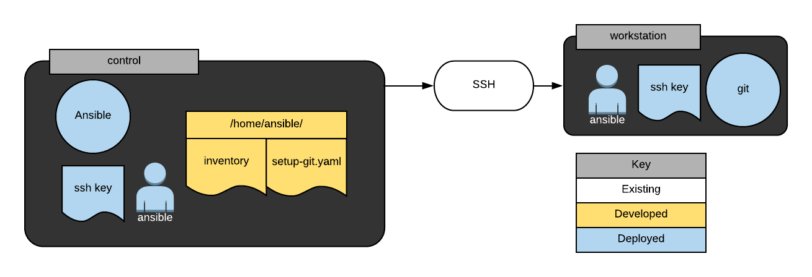

# Deploying Ansible

## Big Picture

## Install Ansible on the Control Host
Log in to the Control Host server using ssh, cloud_user, and the provided Public IP address and password:

`ssh cloud_user@<PUBLIC IP>`
Install epel-release and enter y when prompted:

`sudo yum install epel-release`
Install Ansible and enter y when prompted:

`sudo yum install ansible`

## Create an ansible User
Now, we need to create the ansible user on both the control host and workstation host.

On the control node:

`sudo useradd ansible`
Connect to the workstation node using the provided password:

`ssh workstation`
Add the ansible user to the workstation and set a password for the ansible user. We need to make sure it is something we will remember:

`sudo useradd ansible
sudo passwd ansible
logout`

## Configure a Pre-Shared Key for Ansible
With our user created, we need to create a pre-shared key that allows the user to log in from control to workstation without a password.

Change to the ansible user:

`sudo su - ansible`
Generate a new SSH key, accepting the default settings when prompted:

`ssh-keygen`
Copy the SSH key to workstation, providing the password we created earlier:

`ssh-copy-id workstation`
Test that we no longer need a password to log in to the workstation:

ssh workstation
Once we succeed at logging in, log out of workstation:

logout

## Configure the Ansible User on the Workstation Host
Our next job is to configure the ansible user on the workstation host so that that they may sudo without a password.

Log in to the workstation host as cloud_user using the password provided by the lab:

ssh cloud_user@workstation
Edit the sudoers file:

sudo visudo
Add this line at the end of the file:

ansible       ALL=(ALL)       NOPASSWD: ALL
Save the file:

:wq
Log out of workstation:

logout

## Create a Simple Inventory
Next, we need to create a simple inventory, /home/ansible/inventory, consisting of only the workstation host.

On the control host, as the ansible user, run the following commands:

vim /home/ansible/inventory
Add the text "workstation" to the file and save using :wq in vim.

## Write an Ansible Playbook
We need to write an Ansible playbook into /home/ansible/git-setup.yml on the control node that installs git on workstation, then executes the playbook.

On the control host, as the ansible user, create an Ansible playbook:

vim /home/ansible/git-setup.yml
Add the following text to the file:

`--- # install git on target host
- hosts: workstation
  become: yes
  tasks:
  - name: install git
    yum:
      name: git
      state: latest`
Save and exit the file (:wq in vim).

Run the playbook:

`ansible-playbook -i /home/ansible/inventory /home/ansible/git-setup.yml`
Verify that the playbook ran successfully:

`ssh workstation
which git`

## Conclusion
By completing this lab, we now have a better understanding of how to deploy Ansible, create a connection between two nodes, create a simple inventory, and how to write an Ansible playbook. Congratulations on completing this lab!
